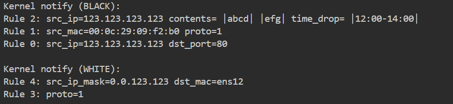
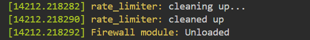
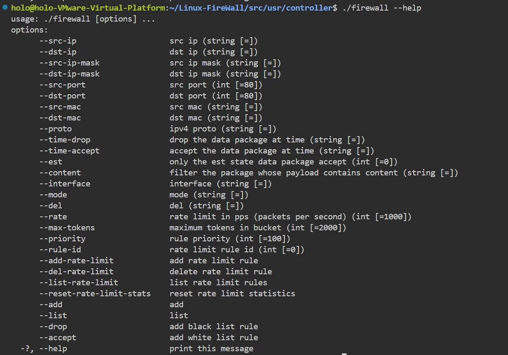
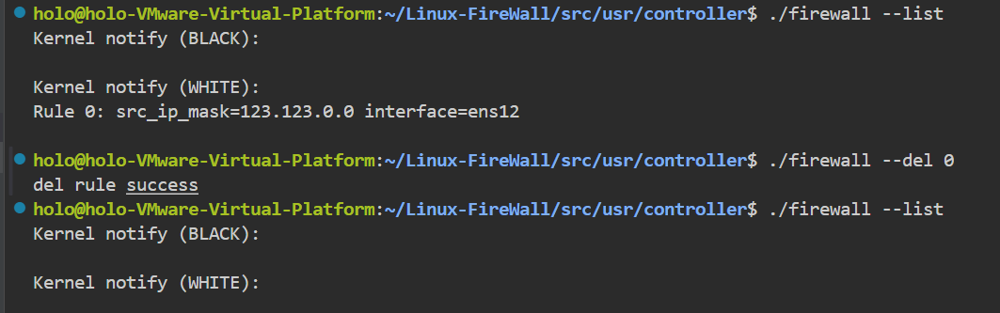

# Linux 个人防火墙

# 1 项目简介

本项目是运行在`Linux`系统下的个人防火墙，支持

+ 基于IP的过滤：根据源IP或目标IP地址或IP掩码进行过滤。
+ 基于端口的过滤：针对TCP和UDP，根据源端口或目标端口进行过滤。
+ 基于协议的过滤：根据IP协议类型进行过滤。
+ 基于MAC地址的过滤：根据源MAC或目标MAC地址进行过滤。
+ 基于包状态的过滤：只允许已建立连接的数据包通过。
+ 基于数据包内容的过滤：检查数据包负载中的特定字符串或模式。
+ 基于时间段的过滤：在特定时间段内启用或禁用规则。
+ 基于网络接口的过滤：根据数据包进入或离开的网络接口进行过滤。
+ 流量限制：限制某个IP或端口的流量速率。
+ 日志记录：对流经防火墙的数据包进行监控和解析。
+ 网页交互：通过网页图形化界面对防火墙进行控制。


# 2 配置环境与运行方式

## 2.1 运行环境

本程序需要在如下环境运行：
+ Ubuntu 24.04.1 LTS 及以上环境
+ lib库中配置 6.14.0-37-generic 及以上Linux内核头文件
+ 支持`gnu99`和`gnu++17`的编译器
+ `make`工具

## 2.2 运行方式

防火墙支持两种界面交互，即命令行界面与网页界面交互。无论哪一种交互方式，
都需要防火墙运行在系统内核层，并且通过用户态的命令行控制程序来发送命令和接收防火墙信息，同时日志信息通过另一个日志程序接收。

### 2.2.1 防火墙内核程序

#### 2.2.1.1 程序编译加载

防火墙的内核程序运行在系统内核，完成主要的防火墙过滤，日志监控，命令接收等功能。

首先需要在`src/kernel_module/`文件目录下，执行`make`命令以编译程序。在编译成功后，得到`myfirewall.ko`内核模块文件，然后通过执行命令
```shell
sudo insmod myfirewall.ko
```
将内核模块加载到系统内核并执行。

最终通过`sudo dmesg`获取内核日志，确认防火墙启动成功。


#### 2.2.1.2 程序卸载

防火墙通过内核模块卸载命令进行卸载关闭，通过执行命令
```shell
sudo rmmod myfirewall.ko
```
将防火墙内核模块进行关闭，可以通过`sudo dmesg`确认关闭成功。


### 2.2.2 防火墙控制程序

防火墙控制程序主要通过解析用户输入的命令，将对应的数据信息发送给防火墙内核以执行对应的安全规则和控制方式。

首先需要进入`src/usr/controller`目录下，执行`make`命令以编译程序，得到`firewall`程序，该程序需要在内核程序运行完毕后才能正常工作。

通过`--help`参数，可以获取程序所支持的安全规则与控制方式：



### 2.2.3 防火墙日志程序
防火墙日志程序主要接收内核日志信息并打印到用户态。

首先需要进入`src/usr/logger`目录下，执行`make`命令以编译程序，得到`logger`程序，该程序需要在内核程序运行完毕后才能正常工作，程序每隔一段时间会输出从内核态接收最新的部分日志以打印到终端。

输入如下命令以运行日志程序
```shell
./logger 
```


### 2.2.4 防火墙前后端程序

# 3 使用说明

## 3.1 命令行使用
```shell
./firewall [命令] [选项1] [参数1] [选项2] [参数2]  
```

### 3.1.1 命令

#### 3.1.1.1 通用命令
+ `add` 增加规则
+ `del` 删除规则
+ `list` 输出当前规则
+ `mode` 更改名单规则

#### 3.1.1.2 流量限制命令
+ `add-rate-limit` 输出流量限制规则
+ `del-rate-limit` 删除流量限制规则
+ `list-rate-limit` 输出流量限制规则以及统计信息
+ `reset-rate-limit-stats` 重置统计信息

### 3.1.2 选项

#### 3.1.2.1 通用选项
+ `--src-ip`
+ `--dst-ip`
+ `--src-ip-mask`
+ `--dst-ip-mask`
+ `--dst-port`
+ `--src-port`
+ `--dst-mac`
+ `--src-mac`
+ `--proto` 要过滤的IPV4协议
+ `--time-drop` 丢弃这段时间内的数据包
+ `--time-accept` 只允许这段时间内的数据包
+ `--est` 只允许建立连接的数据包通过
+ `--content "str1" "str2" "str3" ....` 过滤包含这些关键字的包
+ `--interface` 过滤对应的接口
+ `--drop / --accept` 黑名单/白名单模式下有效
+ `w/W b/B` 更改黑/白名单

#### 3.1.2.2 流量限制选项
+ `--rate` 限速速率（pps）
+ `--max-tokens` 最大令牌数
+ `--priority` 流量限制规则优先级
+ `--rule-id` 流量限制规则id

### 3.1.3  命令行实例

#### 3.1.3.1 --add
`--add`参数用于增加规则，其必须包含`--drop`或`--accept`参数来指明增加的规则是属于黑名单规则还是白名单规则，即对满足匹配规则的数据包进行丢弃还是接受。

```shell
# 过滤进入本机的，源IP地址为:123.123.123.123 目标端口为:80 的数据包
./firewall --add --src-ip 123.123.123.123 --dst-port 80 --drop

# 过滤进入本机的，源MAC地址为：00:0c:29:09:f2:b0 协议为：icmp 的数据包
./firewall --add --src-mac  00:0c:29:09:f2:b0 --proto icmp --drop

# 在12:00 - 14:00 时间段内丢弃所有源地址为：123.123.123.123 内容负载包含：abcd 或 efg 的数据包
./firewall --add --time-drop "12:00 14:00" --src-ip 123.123.123.123 --content ""abcd" "efg"" --drop

# 过滤所有非已建立连接的数据包
./firewall --add --est 1 --drop

# 只允许icmp协议数据包进入本机
./firewall --add --proto icmp --accept

# 只允许通过本机 ens12 网络接口，源地址IP网段属于123.123.0.0的数据包进入本机
./firewall --add --src-ip-mask 123.123.0.0 --interface ens12 --accept

```

#### 3.1.3.2 --list

``--list``参数用于列出当前已存在的防火墙规则。

```shell
./firewall --list
```


#### 3.1.3.3 --del

`--del`参数接受一个`rule id`即`--list`返回的`Rule {rule id}`，以删除选中的规则。

```shell
# 删除Rule 0规则 ，见上图
./firewall --del 0
```


#### 3.1.3.4 --mode
`--mode` 参数接受一个字符以改变防火墙的名单过滤规则，切换黑/白名单过滤。

```shell
# 切换为白名单
./firewall --mode w

./firewall --mode W

# 切换为黑名单
./firewall --mode b

./firewall --mode B
```

#### 3.5.3.5 --add-rate-limit
`--add-rate-limit`命令用于增加流量限制规则，其必须包含`--rate`和`--max-tokens`参数。

```shell
# 限制来自192.168.1.100的流量到1000pps
./firewall --add-rate-limit --src-ip=192.168.1.100 --rate=1000 --max-tokens=2000

# 限制到端口80的HTTP流量到5000pps
./firewall --add-rate-limit --dst-port=80 --rate=5000 --max-tokens=10000 --priority=10

# 限制特定源到特定端口的流量
./firewall --add-rate-limit --src-ip=10.0.0.1 --dst-port=443 --rate=500 --max-tokens=1000

# 严格限制（每秒仅1个包）
./firewall --add-rate-limit --src-ip=192.168.1.1 --rate=1 --max-tokens=1
```

#### 3.5.3.6 --del-rate-limit
`--del-rate-limit`命令用于删除流量限制规则，必须包含`--rule-id`参数指明删除哪一条规则，可通过`--list-rate-limit`查询。

```shell
# 删除规则ID为1的限速规则
./firewall --del-rate-limit --rule-id=1
```

#### 3.5.3.7 --list-rate-limit
`--list-rate-limit`命令显示所有已配置的限速规则及其统计信息，包含：

+ Rule ID：规则唯一标识
+ Rate：限速速率（pps）
+ Max Tokens：令牌桶容量
+ Priority：规则优先级
+ 匹配条件：源/目标IP和端口
+ Status：规则启用/禁用状态
+ 统计信息：已允许/丢弃的包数和字节数

```shell
./firewall --list-rate-limit
```

#### 3.5.3.8 --reset-rate-limit-stats
`--reset-rate-limit-stats`命令必须包含`--rule-id`参数，用于指明重置统计信息的规则，该命令将指定规则的统计信息清零，包括：

 + packets_allowed
 + packets_dropped
 + bytes_allowed
 + bytes_dropped

```shell
./firewall --reset-rate-limit-stats --rule-id=1
```

## 3.2 前后端页面使用

## 4 项目结构

## 5 参考资料


